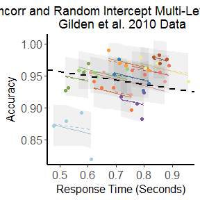

```{r options, echo = F}
opts_chunk$set(dpi = 92,
  fig.path = "figures/", fcacheig.path = "cache/",
  comment = NA, results = 'markup', tidy = F, message = F, warning = F, echo = T, cache = F)
```

```{r inc_hidden, echo = F}
library(ggplot2)
library(pander)

panderOptions('table.continues', '')
panderOptions('big.mark', ',')
panderOptions('table.alignment.default', 'left')

options(tibble.print_max = 3, tibble.print_min = 3)

theme_set(theme_light())
```


# Load packages

```{r inc}
library(magrittr)
library(dplyr)
library(tidyr)

library(MASS)

library(Matrix)
library(lme4)
library(lme4qtl)
```

```{r rmcorr}
library(rmcorr)
```

```{r source}
# change to your path here, e.g. based on `nodemame`
path <- switch(Sys.info()[['nodename']],
  "~/git/hemostat/polycor/" )
  
src <- file.path(path, "relmer.R")
source(src)
```

# Brain volume dataset 

Decription of the longitudinal dataset (`?raz2005`):

> A dataset containing two repeated measures, on two occasions
> (‘Time’), of age and adjusted volume of cerebellar hemispheres
> from 72 participants. Data were captured from Figure 8, Cerebellar
> Hemispheres (lower right) of Raz et al. (2005).

```{r data_show}
data(raz2005, package = "rmcorr")
head(raz2005)
```

144 observations and 4 variables:

- `Participant`: Participant ID (72 participants)
- `Time`: Measurement time (2 time points approximately 5 years apart)
- `Age`: Participant's age (years)
- `Volume`: Adjusted volume of cerebellar hemispheres (cm^3)

The figure below show results of correlation analysis performed under different settings in the `rmcorr` [paper](https://www.ncbi.nlm.nih.gov/pmc/articles/PMC5383908/):

- Linear regression (the Pearson's correlation) at different time points 1 and 2 (two left panels);
- Linear regression on data averaged across time points (right panel);
- ANCOVA model (the intra-individual or longitudinal correlation) that takes into account non-independence among observations (middle panel). 


Intepretation of linear regression results by the authors:

> The interpretation of these results is cross-sectional: They indicate a moderately negative relationship between age and CBH volume across people, where older individuals tend to have a smaller volume and vice versa.

Intepretation of ANCOVA results by the authors:

> These results are interpreted longitudinally, and indicate that as an individual ages, CBH volume tends to decrease.


## Prepare dataset for analysis with lme4

```{r data_prep}
dat <- as_tibble(raz2005) %>% 
  mutate(
    Participant = as.factor(Participant), 
    #Time = as.factor(Time), 
    Obs = as.factor(1:n()))
dat

bdat <- tidyr::gather(dat, tname, tvalue, Age, Volume) # *b*ivariate version of `dat`
bdat
```

# Bivariate model 

Multi-level model:

- Level 1: traits, index `k`, values 1, 2
- Level 2 (baseline): individuals, index `i`, values 1, 2, ..., 72
- Level 3 (longitudinal) : measurements/observations, index `j`, values 1, 2, ..., 144

Level 1:

$Y_{j,i,k} = \mu_{i,k} + R_{j,i,k}$

$R_{j,i,k} \sim N(0, \sigma^2)$

Level 2:

$\mu_{i,k} = \gamma + U_{i,k}$

$[U_{i,1}, U_{i,2}]^T \sim ([0, 0]^T, [\tau^2_1, \tau_{1,2}; \tau_{1,2}, \tau^2_2]$

## Fitting by lme4

```{r bmod}
bmod <- relmer(tvalue ~ tname - 1 + (0 + tname | Participant) + (0 + tname | Obs), 
  data = bdat, weights = rep(1e10, nrow(bdat)), calc.derivs = FALSE)

bmod
```

### BLUPs

BLUPS predicts two traits at two levels, high-level (Participant) and lower-level (Observation).

```{r ranef}
ranef(bmod) %>% names
ranef(bmod)[["Participant"]] %>% as_tibble
ranef(bmod)[["Obs"]] %>% as_tibble
```

```{r ranef1, echo = F, fig.show = "hold", out.width = "50%", cache = TRUE}
r <- ranef(bmod)

robs <- r$Obs %>% as_tibble
robs <- mutate(robs, Obs = levels(bmod@frame$Obs))
p1 <- ggplot(robs, aes(tnameAge, tnameVolume)) + geom_point() + geom_smooth(method = "lm", se = FALSE, color = "red") + labs(title = paste0("BLUP (1|Obs): 144 = 72 Part. x 2 Time points"), subtitle = "rho [lmm] = -0.70 \nrho [Pearson] = -0.71 (red line on the plot)")

set.seed(1)
parts <- sample(dat$Participant, 1, replace = FALSE)
obs <- filter(dat, Participant %in% parts) %$% Obs
robs1 <- filter(robs, Obs %in% obs)
p1 <- p1 + geom_segment(aes(tnameAge[1], tnameVolume[1], xend = tnameAge[2], yend = tnameVolume[2]), data = robs1, color = "blue")

rpart <- r$Participant %>% as_tibble
rpart <- mutate(rpart, Participant = levels(bmod@frame$Participant))
p2 <- ggplot(rpart, aes(tnameAge, tnameVolume)) + geom_point() + geom_smooth(method = "lm", se = FALSE, color = "red") + labs(title = paste0("BLUP (1|Part.): 72 Part."), subtitle = "rho [lmm] = 0.37 \nrho [Pearson] = -0.36 (red line on the plot)")

p2
p1
```

### Prediction at Participant level 

```{r pred}
pred <- predict(bmod, re.form= ~(0 + tname | Participant))
```

```{r pred_plot, echo = F, cache = T}
pred <- as.numeric(pred)

N <- length(pred)/2

pdat <- bind_cols(dat, predAge = pred[seq(N)],
  predVolume = pred[N + seq(N)])
  
pdat <- mutate(pdat, 
  Participants = ifelse(Participant %in% 1:7, Participant, "Other")) 

p3 <- ggplot(pdat, aes(Age, Volume, group = Participant, color = Participants)) + geom_line() + geom_point(aes(predAge, predVolume, color = Participants)) + scale_color_brewer(type = "qual")

p3
```


### Predictions

```{r pred2}
predRE0 <- predict(bmod, re.form = NA) # all FE, no RE
predRE <- predict(bmod) # all RE
predRE1 <- predict(bmod, re.form= ~(0 + tname | Participant)) # one RE

pbdat <- bind_cols(bdat, tvaluePredRE0 = predRE0, tvaluePredRE = predRE, tvaluePredRE1 = predRE1)

filter(pbdat, Participant == 1) %>% as.data.frame
```

# TODO

1. Figure out the difference between the following models and our basic bivariate model `bmod`.
See https://rpsychologist.com/r-guide-longitudinal-lme-lmer.

```{r models}
# (to cofirm) expression `tname/Time` defines vertical hieararchy tname -> Time
relmer(tvalue ~ tname - 1 + (0 + tname/Time | Participant) + (0 + tname/Time | Obs), data = bdat, weights = rep(1e10, nrow(bdat)), calc.derivs = FALSE)

# (to cofirm) expression `tname:Time` defines a horizontal hieararchy tname -> Time
relmer(tvalue ~ tname - 1 + (0 + tname:Time | Participant) + (0 + tname:Time | Obs), data = bdat, weights = rep(1e10, nrow(bdat)), calc.derivs = FALSE)
```

# Appendix

## Bivariate model at single Time point 1 or 2


```{r bmod1}
bdat1 <- subset(bdat, Time == 1)

bmod1 <- relmer(tvalue ~ tname - 1 + (0 + tname | Participant) + (0 + tname | Obs), 
  data = bdat1, weights = rep(1e10, nrow(bdat1)), calc.derivs = FALSE)

bmod1
```


```{r bmod2}
bdat2 <- subset(bdat, Time == 2)

bmod2 <- relmer(tvalue ~ tname - 1 + (0 + tname | Participant) + (0 + tname | Obs), 
  data = bdat2, weights = rep(1e10, nrow(bdat2)), calc.derivs = FALSE)

bmod2
```

### BLUPs

```{r ranef_bmod2, echo = F, fig.show = "hold", out.width = "50%", cache = TRUE}
r <- ranef(bmod2)

robs <- r$Obs %>% as_tibble
robs <- mutate(robs, Obs = levels(bmod2@frame$Obs))
p1 <- ggplot(robs, aes(tnameAge, tnameVolume)) + geom_point() + geom_smooth(method = "lm", se = FALSE, color = "red") + labs(title = paste0("BLUP (1|Obs): 72 = 72 Part. x 1 Time point"))

rpart <- r$Participant %>% as_tibble
rpart <- mutate(rpart, Participant = levels(bmod2@frame$Participant))
p2 <- ggplot(rpart, aes(tnameAge, tnameVolume)) + geom_point() + geom_smooth(method = "lm", se = FALSE, color = "red") + labs(title = paste0("BLUP (1|Part.): 72 Part."))

p2
p1
```

### Drop the redundant term?

```{r drop1}
bmod21 <- update(bmod2, . ~ . - (0 + tname | Obs))
bmod21

anova(bmod2, bmod21)
```

## Bivariate with Time-dependent Intercept

```{r bmodt}
bmodt <- relmer(tvalue ~ tname - 1 + Time + (0 + tname | Participant) + (0 + tname | Obs), 
  data = bdat, weights = rep(1e10, nrow(bdat)), calc.derivs = FALSE)

bmodt
```

```{r anovat}
anova(bmod, bmodt)
```

## Dataset with >2 repetitions



```{r dat3}
data(gilden2010, package = "rmcorr")
dat3 <- as_tibble(gilden2010) %>% 
  mutate(
    sub = as.factor(sub), 
    block = as.integer(block), 
    obs = as.factor(1:n()))

# *b*ivariate version of `dat3`
bdat3 <- tidyr::gather(dat3, tname, tvalue, acc, rt) %>%
    mutate(tindex = (as.integer(as.factor(tname)) - 1L))

bmod3 <- relmer(tvalue ~ tname - 1 + (0 + tname | sub/block), bdat3, weights = rep(1e10, nrow(bdat3)), calc.derivs = FALSE)

#relmer(tvalue ~ tname - 1 + (0 + tname | sub / block), bdat3, weights = rep(1e10, nrow(bdat3)), calc.derivs = FALSE)

#relmer(tvalue ~ tname - 1 + (1 + block || sub / tname), bdat3, weights = rep(1e10, nrow(bdat3)), calc.derivs = FALSE)

#relmer(tvalue ~ tname - 1 + (0 + block / tname| obs), bdat3, weights = rep(1e10, nrow(bdat3)), calc.derivs = FALSE)
```


