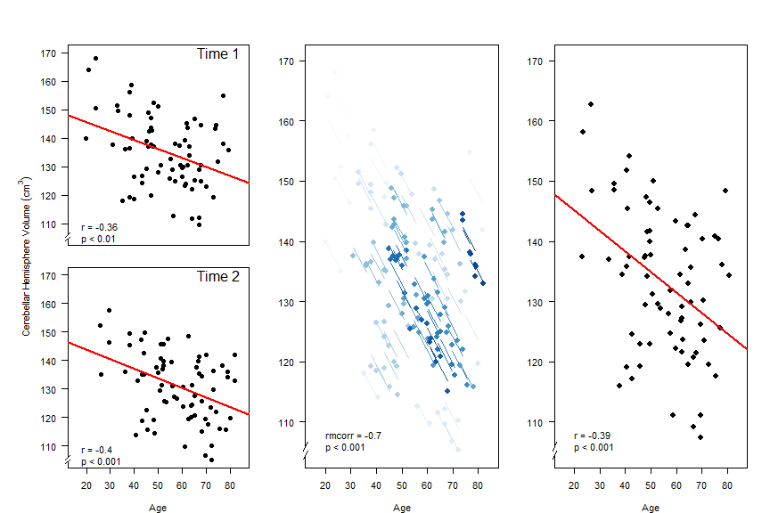
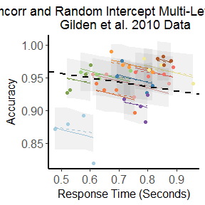

# Load packages


```r
library(magrittr)
library(dplyr)
library(tidyr)

library(MASS)

library(Matrix)
library(lme4)
library(lme4qtl)
```


```r
library(rmcorr)
```


```r
# change to your path here, e.g. based on `nodemame`
path <- switch(Sys.info()[['nodename']],
  "~/git/hemostat/polycor/" )
  
src <- file.path(path, "relmer.R")
source(src)
```

# Brain volume dataset 

Decription of the longitudinal dataset (`?raz2005`):

> A dataset containing two repeated measures, on two occasions
> (‘Time’), of age and adjusted volume of cerebellar hemispheres
> from 72 participants. Data were captured from Figure 8, Cerebellar
> Hemispheres (lower right) of Raz et al. (2005).


```r
data(raz2005, package = "rmcorr")
head(raz2005)
```

```
  Participant Time      Age   Volume
1           1    1 24.04637 168.0261
2           1    2 29.28124 157.5085
3           2    1 21.02195 164.0444
4           2    2 25.91324 152.3567
5           3    1 23.92362 150.4820
6           3    2 29.57359 146.3979
```

144 observations and 4 variables:

- `Participant`: Participant ID (72 participants)
- `Time`: Measurement time (2 time points approximately 5 years apart)
- `Age`: Participant's age (years)
- `Volume`: Adjusted volume of cerebellar hemispheres (cm^3)

The figure below show results of correlation analysis performed under different settings in the `rmcorr` [paper](https://www.ncbi.nlm.nih.gov/pmc/articles/PMC5383908/):

- Linear regression (the Pearson's correlation) at different time points 1 and 2 (two left panels);
- Linear regression on data averaged across time points (right panel);
- ANCOVA model (the intra-individual or longitudinal correlation) that takes into account non-independence among observations (middle panel). 



Intepretation of linear regression results by the authors:

> The interpretation of these results is cross-sectional: They indicate a moderately negative relationship between age and CBH volume across people, where older individuals tend to have a smaller volume and vice versa.

Intepretation of ANCOVA results by the authors:

> These results are interpreted longitudinally, and indicate that as an individual ages, CBH volume tends to decrease.


## Prepare dataset for analysis with lme4


```r
dat <- as_tibble(raz2005) %>% 
  mutate(
    Participant = as.factor(Participant), 
    #Time = as.factor(Time), 
    Obs = as.factor(1:n()))
dat
```

```
# A tibble: 144 x 5
  Participant  Time   Age Volume Obs  
  <fct>       <int> <dbl>  <dbl> <fct>
1 1               1  24.0   168. 1    
2 1               2  29.3   158. 2    
3 2               1  21.0   164. 3    
# ... with 141 more rows
```

```r
bdat <- tidyr::gather(dat, tname, tvalue, Age, Volume) # *b*ivariate version of `dat`
bdat
```

```
# A tibble: 288 x 5
  Participant  Time Obs   tname tvalue
  <fct>       <int> <fct> <chr>  <dbl>
1 1               1 1     Age     24.0
2 1               2 2     Age     29.3
3 2               1 3     Age     21.0
# ... with 285 more rows
```

# Bivariate model 

Multi-level model:

- Level 1: traits, index `k`, values 1, 2
- Level 2 (baseline): individuals, index `i`, values 1, 2, ..., 72
- Level 3 (longitudinal) : measurements/observations, index `j`, values 1, 2, ..., 144

Level 1:

$Y_{j,i,k} = \mu_{i,k} + R_{j,i,k}$

$R_{j,i,k} \sim N(0, \sigma^2)$

Level 2:

$\mu_{i,k} = \gamma + U_{i,k}$

$[U_{i,1}, U_{i,2}]^T \sim ([0, 0]^T, [\tau^2_1, \tau_{1,2}; \tau_{1,2}, \tau^2_2]$

## Fitting by lme4


```r
bmod <- relmer(tvalue ~ tname - 1 + (0 + tname | Participant) + (0 + tname | Obs), 
  data = bdat, weights = rep(1e10, nrow(bdat)), calc.derivs = FALSE)

bmod
```

```
Linear mixed model fit by REML ['lmerMod']
Formula: tvalue ~ tname - 1 + (0 + tname | Participant) + (0 + tname |  
    Obs)
   Data: bdat
Weights: rep(1e+10, nrow(bdat))
REML criterion at convergence: 1976.467
Random effects:
 Groups      Name        Std.Dev. Corr 
 Obs         tnameAge     3.599        
             tnameVolume  4.077   -0.70
 Participant tnameAge    14.051        
             tnameVolume 11.633   -0.37
 Residual                11.846        
Number of obs: 288, groups:  Obs, 144; Participant, 72
Fixed Effects:
   tnameAge  tnameVolume  
       55.3        133.1  
```

### BLUPs

BLUPS predicts two traits at two levels, high-level (Participant) and lower-level (Observation).


```r
ranef(bmod) %>% names
```

```
[1] "Obs"         "Participant"
```

```r
ranef(bmod)[["Participant"]] %>% as_tibble
```

```
# A tibble: 72 x 2
  tnameAge tnameVolume
*    <dbl>       <dbl>
1    -27.2        27.8
2    -30.4        23.5
3    -27.5        14.3
# ... with 69 more rows
```

```r
ranef(bmod)[["Obs"]] %>% as_tibble
```

```
# A tibble: 144 x 2
  tnameAge tnameVolume
*    <dbl>       <dbl>
1    -4.04        7.10
2     1.19       -3.42
3    -3.83        7.46
# ... with 141 more rows
```


### Prediction at Participant level 


```r
pred <- predict(bmod, re.form= ~(0 + tname | Participant))
```

<!-- -->


### Predictions


```r
predRE0 <- predict(bmod, re.form = NA) # all FE, no RE
predRE <- predict(bmod) # all RE
predRE1 <- predict(bmod, re.form= ~(0 + tname | Participant)) # one RE

pbdat <- bind_cols(bdat, tvaluePredRE0 = predRE0, tvaluePredRE = predRE, tvaluePredRE1 = predRE1)

filter(pbdat, Participant == 1) %>% as.data.frame
```

```
  Participant Time Obs  tname    tvalue tvaluePredRE0 tvaluePredRE
1           1    1   1    Age  24.04637      55.30331     24.04637
2           1    2   2    Age  29.28124      55.30331     29.28124
3           1    1   1 Volume 168.02605     133.10921    168.02605
4           1    2   2 Volume 157.50848     133.10921    157.50848
  tvaluePredRE1
1      28.08961
2      28.08961
3     160.93042
4     160.93042
```

# TODO

1. Figure out the difference between the following models and our basic bivariate model `bmod`.
See https://rpsychologist.com/r-guide-longitudinal-lme-lmer.


```r
# (to cofirm) expression `tname/Time` defines vertical hieararchy tname -> Time
relmer(tvalue ~ tname - 1 + (0 + tname/Time | Participant) + (0 + tname/Time | Obs), data = bdat, weights = rep(1e10, nrow(bdat)), calc.derivs = FALSE)
```

```
Linear mixed model fit by REML ['lmerMod']
Formula: 
tvalue ~ tname - 1 + (0 + tname/Time | Participant) + (0 + tname/Time |  
    Obs)
   Data: bdat
Weights: rep(1e+10, nrow(bdat))
REML criterion at convergence: 1968.036
Random effects:
 Groups      Name             Std.Dev. Corr             
 Obs         tnameAge          4.721                    
             tnameVolume       8.153   -0.18            
             tnameAge:Time     2.437   -0.92  0.52      
             tnameVolume:Time  5.656    0.00 -0.98 -0.37
 Participant tnameAge         22.047                    
             tnameVolume      12.662   -0.14            
             tnameAge:Time     3.886   -0.86 -0.27      
             tnameVolume:Time  3.358    0.80 -0.02 -0.92
 Residual                      6.486                    
Number of obs: 288, groups:  Obs, 144; Participant, 72
Fixed Effects:
   tnameAge  tnameVolume  
      65.61       139.63  
```

```r
# (to cofirm) expression `tname:Time` defines a horizontal hieararchy tname -> Time
relmer(tvalue ~ tname - 1 + (0 + tname:Time | Participant) + (0 + tname:Time | Obs), data = bdat, weights = rep(1e10, nrow(bdat)), calc.derivs = FALSE)
```

```
Linear mixed model fit by REML ['lmerMod']
Formula: 
tvalue ~ tname - 1 + (0 + tname:Time | Participant) + (0 + tname:Time |  
    Obs)
   Data: bdat
Weights: rep(1e+10, nrow(bdat))
REML criterion at convergence: 2230.881
Random effects:
 Groups      Name             Std.Dev. Corr 
 Obs         tnameAge:Time     5.303        
             tnameVolume:Time  5.164   -0.34
 Participant tnameAge:Time    10.286        
             tnameVolume:Time  8.508   -0.42
 Residual                      7.152        
Number of obs: 288, groups:  Obs, 144; Participant, 72
Fixed Effects:
   tnameAge  tnameVolume  
      51.21       136.20  
```

# Appendix

## Bivariate model at single Time point 1 or 2


```r
bdat1 <- subset(bdat, Time == 1)

bmod1 <- relmer(tvalue ~ tname - 1 + (0 + tname | Participant) + (0 + tname | Obs), 
  data = bdat1, weights = rep(1e10, nrow(bdat1)), calc.derivs = FALSE)

bmod1
```

```
Linear mixed model fit by REML ['lmerMod']
Formula: tvalue ~ tname - 1 + (0 + tname | Participant) + (0 + tname |  
    Obs)
   Data: bdat1
Weights: rep(1e+10, nrow(bdat1))
REML criterion at convergence: 1138.799
Random effects:
 Groups      Name        Std.Dev. Corr 
 Participant tnameAge    11.584        
             tnameVolume  8.553   -0.35
 Obs         tnameAge     8.486        
             tnameVolume  9.142   -0.39
 Residual                 9.101        
Number of obs: 144, groups:  Participant, 72; Obs, 72
Fixed Effects:
   tnameAge  tnameVolume  
       52.8        135.2  
```


```r
bdat2 <- subset(bdat, Time == 2)

bmod2 <- relmer(tvalue ~ tname - 1 + (0 + tname | Participant) + (0 + tname | Obs), 
  data = bdat2, weights = rep(1e10, nrow(bdat2)), calc.derivs = FALSE)

bmod2
```

```
Linear mixed model fit by REML ['lmerMod']
Formula: tvalue ~ tname - 1 + (0 + tname | Participant) + (0 + tname |  
    Obs)
   Data: bdat2
Weights: rep(1e+10, nrow(bdat2))
REML criterion at convergence: 1126.891
Random effects:
 Groups      Name        Std.Dev. Corr 
 Participant tnameAge    11.674        
             tnameVolume  8.602   -0.39
 Obs         tnameAge     8.003        
             tnameVolume  8.192   -0.42
 Residual                 8.997        
Number of obs: 144, groups:  Participant, 72; Obs, 72
Fixed Effects:
   tnameAge  tnameVolume  
       57.8        131.1  
```

### BLUPs


### Drop the redundant term?


```r
bmod21 <- update(bmod2, . ~ . - (0 + tname | Obs))
bmod21
```

```
Linear mixed model fit by REML ['lmerMod']
Formula: tvalue ~ tname + (0 + tname | Participant) - 1
   Data: bdat2
Weights: rep(1e+10, nrow(bdat2))
REML criterion at convergence: 1126.891
Random effects:
 Groups      Name        Std.Dev. Corr 
 Participant tnameAge    14.15         
             tnameVolume 11.88    -0.40
 Residual                13.48         
Number of obs: 144, groups:  Participant, 72
Fixed Effects:
   tnameAge  tnameVolume  
       57.8        131.1  
```

```r
anova(bmod2, bmod21)
```

```
Data: bdat2
Models:
bmod21: tvalue ~ tname + (0 + tname | Participant) - 1
bmod2: tvalue ~ tname - 1 + (0 + tname | Participant) + (0 + tname | 
bmod2:     Obs)
       Df    AIC    BIC  logLik deviance Chisq Chi Df Pr(>Chisq)
bmod21  6 1144.1 1161.9 -566.04   1132.1                        
bmod2   9 1150.1 1176.8 -566.04   1132.1 3e-04      3          1
```

## Bivariate with Time-dependent Intercept


```r
bmodt <- relmer(tvalue ~ tname - 1 + Time + (0 + tname | Participant) + (0 + tname | Obs), 
  data = bdat, weights = rep(1e10, nrow(bdat)), calc.derivs = FALSE)

bmodt
```

```
Linear mixed model fit by REML ['lmerMod']
Formula: tvalue ~ tname - 1 + Time + (0 + tname | Participant) + (0 +  
    tname | Obs)
   Data: bdat
Weights: rep(1e+10, nrow(bdat))
REML criterion at convergence: 1858.976
Random effects:
 Groups      Name        Std.Dev. Corr 
 Obs         tnameAge     0.7803       
             tnameVolume  6.7481  -0.49
 Participant tnameAge    14.0737       
             tnameVolume 10.8966  -0.38
 Residual                 4.3818       
Number of obs: 288, groups:  Obs, 144; Participant, 72
Fixed Effects:
   tnameAge  tnameVolume         Time  
      48.64       126.46         4.44  
```


```r
anova(bmod, bmodt)
```

```
Data: bdat
Models:
bmod: tvalue ~ tname - 1 + (0 + tname | Participant) + (0 + tname | 
bmod:     Obs)
bmodt: tvalue ~ tname - 1 + Time + (0 + tname | Participant) + (0 + 
bmodt:     tname | Obs)
      Df    AIC    BIC  logLik deviance  Chisq Chi Df Pr(>Chisq)    
bmod   9 1999.7 2032.7 -990.85   1981.7                             
bmodt 10 1882.7 1919.3 -931.35   1862.7 119.01      1  < 2.2e-16 ***
---
Signif. codes:  0 '***' 0.001 '**' 0.01 '*' 0.05 '.' 0.1 ' ' 1
```

## Dataset with >2 repetitions




```r
data(gilden2010, package = "rmcorr")
dat3 <- as_tibble(gilden2010) %>% 
  mutate(
    sub = as.factor(sub), 
    block = as.integer(block), 
    obs = as.factor(1:n()))

# *b*ivariate version of `dat3`
bdat3 <- tidyr::gather(dat3, tname, tvalue, acc, rt) %>%
    mutate(tindex = (as.integer(as.factor(tname)) - 1L))

bmod3 <- relmer(tvalue ~ tname - 1 + (0 + tname | sub/block), bdat3, weights = rep(1e10, nrow(bdat3)), calc.derivs = FALSE)

#relmer(tvalue ~ tname - 1 + (0 + tname | sub / block), bdat3, weights = rep(1e10, nrow(bdat3)), calc.derivs = FALSE)

#relmer(tvalue ~ tname - 1 + (1 + block || sub / tname), bdat3, weights = rep(1e10, nrow(bdat3)), calc.derivs = FALSE)

#relmer(tvalue ~ tname - 1 + (0 + block / tname| obs), bdat3, weights = rep(1e10, nrow(bdat3)), calc.derivs = FALSE)
```


